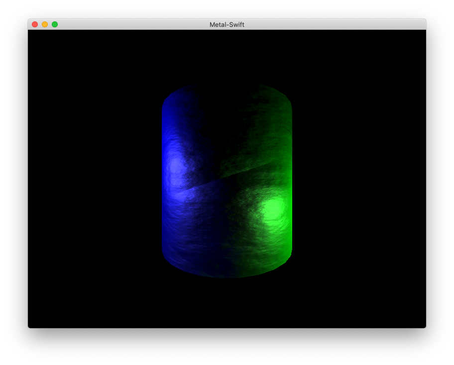

Metal-Swift
===========

This is a simple example of using Swift to create a Metal application for macOS. It features a rotating, normal mapped cylinder that is illuminated by three moving point lights of different colors.

This application was developed by [Josh Beam](https://joshbeam.com/) and is distributed under a [BSD-style license](LICENSE).
